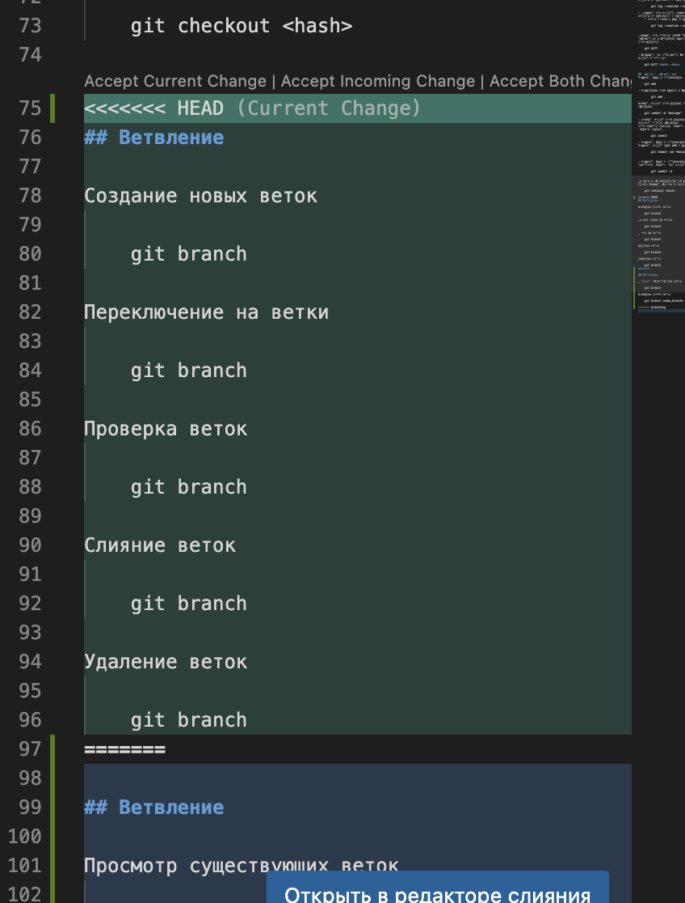
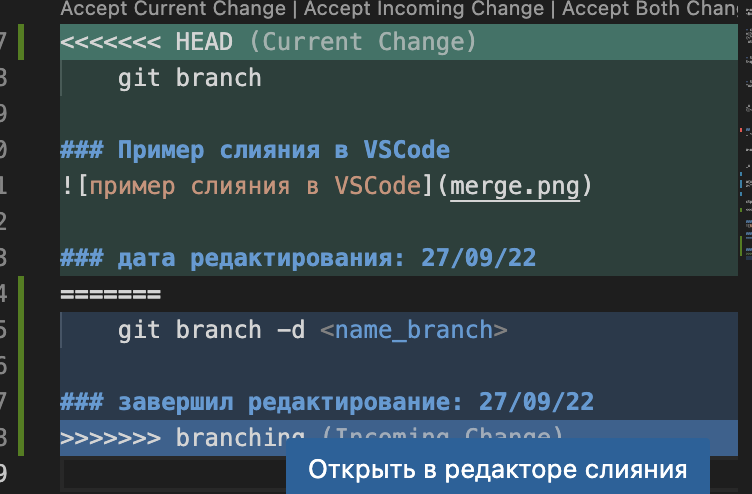

# Инструкция по работе с системой контроля версий Git

## Что такое Git?
- это система управления версиями с распределенной архитектурой

## Начальная настройка
### Установка пользователя
    $ git config --global user.name "John Doe"

### Установка почты
    $ git config --global user.email johndoe@example.com

### Посмотреть имя (почту)    
    $ git config --global user.name
    $ git config --global user.email

### Установка пользователя и почты для конкретного репозитория
    $ git config user.name "John Doe"
    $ git config user.email johndoe@example.com

## Создание репозитория
Создание нового репозитория (инициализация)

    git init

### Проверка состояния репозитория
Показать статус (ветки, коммиты (сохранения), несохраненнные (незакоммитченные) изменения)

    git status

Вывести историю сохранения (коммитов), журнал всех изменений

    git log

- более удобный вывод истории сохранения (коммитов) полинейно

        git log --oneline

- Показать все коммиты, незивисимо на каком коммите мы находимся в данный момен

        git log --oneline --all

- Показать все коммиты, незивисимо на каком коммите мы находимся в данный момент + вывод в виде графа (--graph)

        git log --oneline --all --graph

Показать все отличия между текущим состоянием репозитория и последним закомиченным (сохраненным)

    git diff

- показать чем отличается первый указанный коммит от второго

        git diff <hash> <hash>

Переключение на нужное изменение

    git checkout <хэш>

## Работа с репозиторием
Добавить файл к отслеживанию

    git add

- добавление всех файлов и папок в репозиторий

        git add .

Создать коммит (сохранение) с *кратким* описанием

    git commit -m "message"

- cоздать коммит (сохранение) с *многострочным* описанием  
(открывается внешний редактор для редактирования)

        git commit

- добавить файл в отслеживани и сразу добавить коммит (git add + git commit)
        
        git commit -am "message"

- добавить файл в остлеживание и открыть текстовый редактор для коммита

        git commit -a

Перейти к определенному сохранению(коммиту) (можно указать первые 4 символа)

    git checkout <hash>

## Ветвление
Просмотр существующих веток

    git branch

Создание новых веток
    
    git branch <name_branch>

Переключение на ветки

    git checkout <name_branch>

Слияние веток (<name_branch> сливается в ту в которой мы находимся)

    git merge <name_branch>

Удаление веток

    git branch -d <name_branch>
 

Удаление принудительное, без проверки на слияние (merged)

    git branch -D <name_branch> 

Удаление ветки на удаленном репозитории

    git push origin --delete <name_branch>
    
### Пример-1 слияния в VSCode

### Пример-2 слияния в VSCode

## Удаленные репозитории
    
### Связывание локального репозитория с удаленным
    
    git remote add origin git@github.com:sorvic/seminar3.git
       
- устанавливаем основную ветку "main"

        git branch -M main  

- выгружаем локальные данные

        git push -u origin main 

### Клонирование репозитория

    git clone <путь к репозиторию>

### Создание "Форка"
 В выбранном удаленном репозитории нажимаем fork и "копируем" репозитоий  к себе

 Далее клонируем **свой** удаленный репозиторий к себе

    git clone <путь к репозиторию>

### **ВАЖНО:**
все изменения в форкнутом репозитории делаем в отждельной ветке

## Копирование локальных изменений
из ветки, которая отсутствует в удаленном репозитории

    git push --set-upstream origin remote

### Удаление связи с удаленным репозиторием

    git remote -v

### Перепривязка локального репозитоия с удаленным (чтобы не удалять его)

    git remote set-url origin git@github.com:sorvic/dz-03.git
